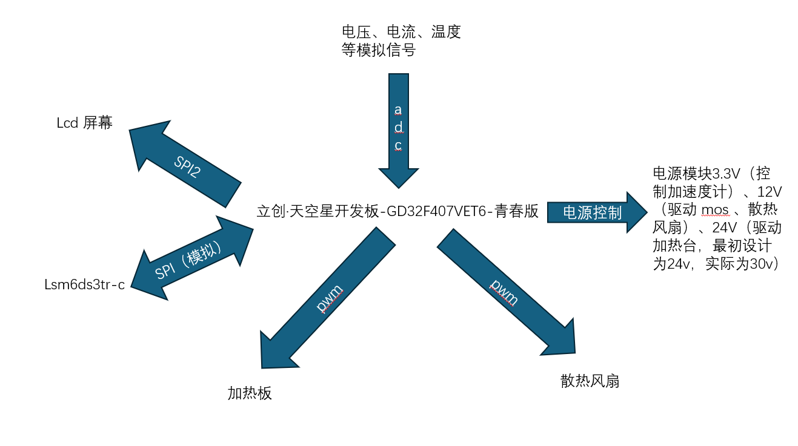
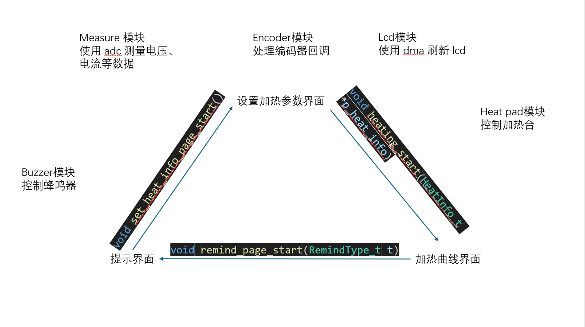

# MINI 加热台 - AtomHeat

## 项目简介

- 该项目是基于立创·天空星开发板-GD32F407VET6-青春版的小型加热台。

- 支持使用 Type-C 接口和 5.5*2.5 DC 接口供电。Type-C 接口最高支持 100W PD 协议，DC 接口支持 16.5v-25.5v 电压。

## 快速链接

- [Github](https://github.com/EcutAtom336/AtomHeat)

- [立创开源硬件平台](http://oshwhub.com/dter/atomheat)

## 功能描述

- 使用 Type-C 接口或 DC 接口供电。理论工作电压为 16.5v-25.5v，兼容 5-6 串锂电池实际仅测试 100W PD 供电。

- 内置加速度计和蜂鸣器，当机身倾倒时候会停止加热并发出提示音。

- 5 个触摸按键和一个旋钮编码器，可设置分时分段加热。可储存5个快捷温度预设。

- 1.8 寸 tft lcd，可显示加热功率、当前温度和加热曲线。

## 复刻指南

### 硬件

#### 硬件架构

- 项目 BOM 表在 /production_doc 下，分别为：

1. BOM_Board1_V0.3_Schematic1_V0.3_2024-08-13.xlsx

2. BOM_Board2_V0.2_Schematic2_V0.2_2024-08-13.xlsx

- 3D 打印外壳文件在 /production_doc/3d_print 下。

- CNC 制造文件在 /production_doc/cnc 下。

- 面板制造文件在 /production_doc/panel 下。

- PCB 制造文件在 /production_doc/pcb 下。

- 其他硬件在 /production_doc/other.xlsx 有详细介绍和购买地址。

### 软件

#### 软件架构

- 软件使用 EIDE 开发，源码在 /embed 下，该目录 readme 有详细的软件介绍。

### 烧录

- 已编译的固件已上传至附件

- 有多种方式烧录固件，可前往[立创开发板资料](https://lceda001.feishu.cn/wiki/Zawdwg0laig3Qnk2XuxcKrQRn2g)查看详细教程

## 安全警告

- Type-C 接口和 DC 接口没有防倒灌设计，请勿同时使用 Type-C 接口和 DC 接口供电，否则后果自负。

- 加热台工作时，请注意安全。

## 备注

- 加热控制使用 pwm 控制平均功率，瞬时功率大约 120W 以上，即使使用功率限制功能，小功率充电器依然可能过载重启（例如使用 67W 充电器并将最大功率限制在 60W）。

- 当温度达到 300 摄氏度以上时，散热功率接近加热功率，温度上升非常缓慢。

- 为适应项目需求中的低压、高温，本项目使用了 cnc 加工，复刻成本较高。

- 演示视频链接

1.[【星火计划-悬赏赛道】MINI加热台 AtomHeat 功能演示1](https://www.bilibili.com/video/BV15wYYe4EQf/?share_source=copy_web&vd_source=9ee252657cef98d209294340e74664c1)

2.[【星火计划-悬赏赛道】MINI加热台 AtomHeat 功能演示2](https://www.bilibili.com/video/BV1ewYYe4Ey1/?share_source=copy_web&vd_source=9ee252657cef98d209294340e74664c1)
